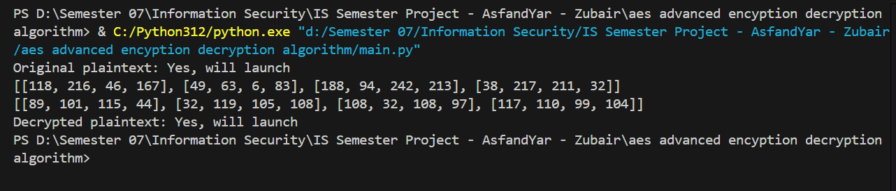
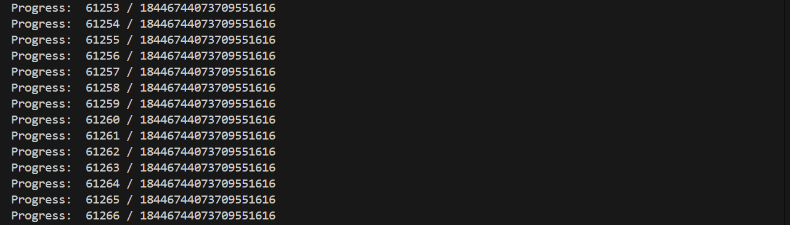

# AES Advanced Encryption and Deduction Attack

## Overview
This repository contains:
1. **Advanced AES Encryption/Decryption Algorithm**:
   - Custom modifications to the standard AES algorithm.
   - Includes enhanced key expansion and additional randomness.
2. **Deduction Attack**:
   - Simulates an attack to test the algorithm's resilience.

---

## Files

### 1. `main.py`
- Implements the modified AES encryption and decryption logic.
- Includes:
  - **Custom Key Expansion**: Introduces randomness and enhanced entropy.
  - **Encryption**: Pads plaintext, applies rounds with `SubBytes`, `ShiftRows`, `MixColumns`, and `AddRoundKey`.
  - **Decryption**: Reverses encryption with inverse transformations.

### 2. `attack.py`
- Demonstrates a deduction attack on the encrypted data.
- Attempts to infer plaintext patterns from ciphertext using statistical analysis and trial decryption.

---

## Usage

### Encryption and Decryption
1. Run the AES encryption and decryption script:
   ```bash
   python main.py
   


2. Run the deduction attack script:
   ```bash
   python attack.py



